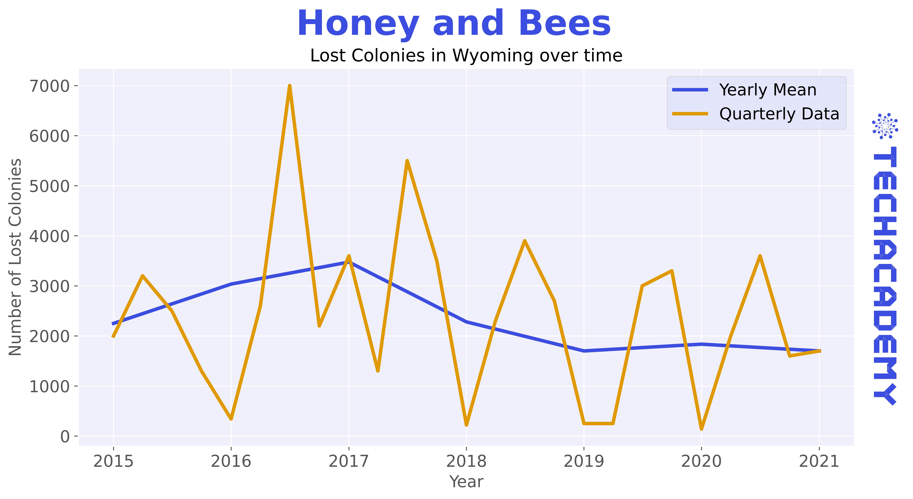
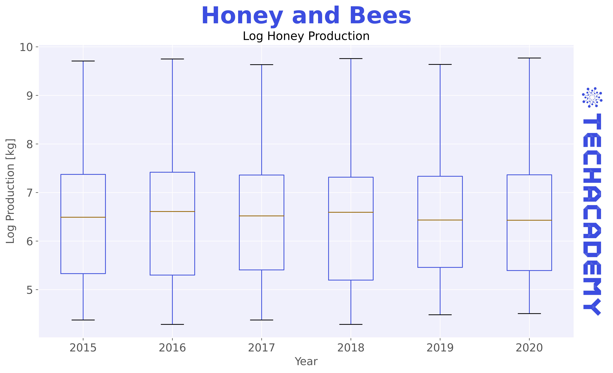
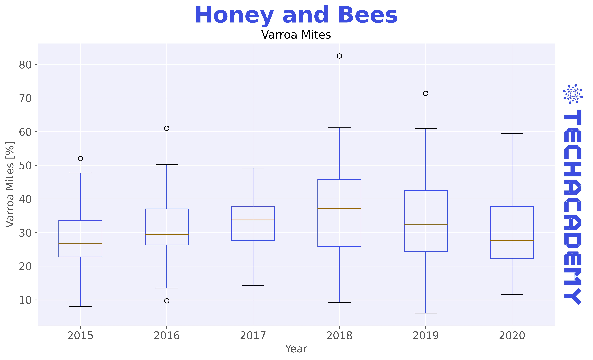
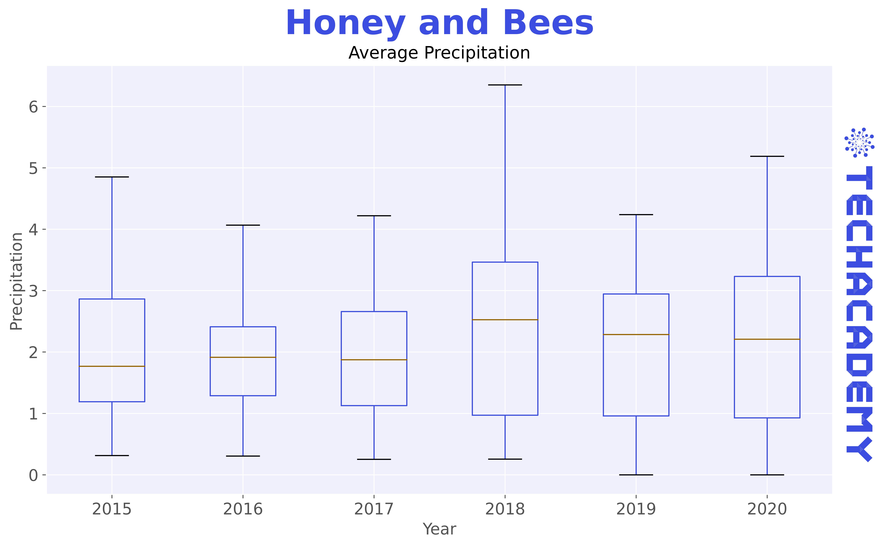
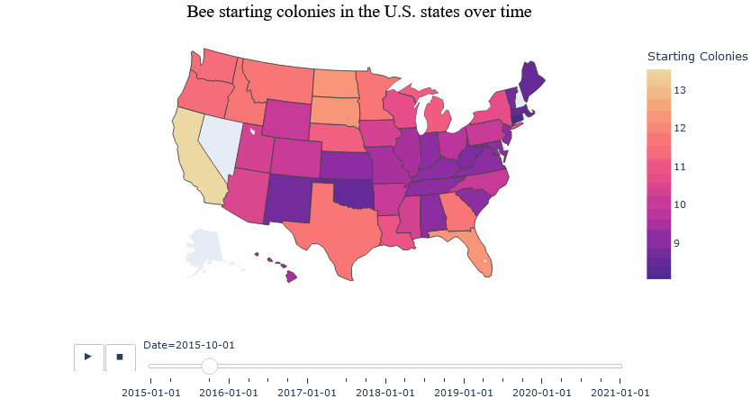

```{r, include=FALSE}
# Preliminaries
library(tidyverse)
library(dplyr)
library(tidyr)
library(ggplot2)
library(maps)
# library(countrycode)
library(leaflet)
#library(geojsonio)
library(viridis)
library(magick) # for including a .png in plots
TA_logo <- image_read("plot/TA_logo.png")
# library(gghighlight)
library(GGally)
library(ggrepel)
```

\newpage

# Exploratory Data Analysis

Before you can dive into the data, set up your programming environment.
This will be the place where the magic happens - all your coding takes place there.

::: {.tips .r data-latex="r"}
In your workspace on [RStudio Cloud](https://rstudio.cloud/projects), we have already uploaded an "assignment" for you (Template HoneyAndBees).
When you create a new project within the workspace *Class of '22 \| TechAcademy \| Data Science with R*, your workspace will open up.

We've already made some arrangements for you: The data sets you will be working with throughout the project are already available in your working directory.
We also created an RMarkdown file (a file that ends with `.Rmd` extension), with which you will be able to create a detailed report of your project.
You can convert that file into an HTML document when you have finished coding the project in R.
Open the file `Markdown_HoneyAndBees.Rmd` and see for yourself!
:::

::: {.tipsp .python data-latex="p"}
We recommend using [Google Colab](https://colab.research.google.com) for this project since it requires no particular setup, stores its notebooks to your Google Drive, and makes it easy for you to share them with your team members.

As an alternative to Google Colab, you might want to install Jupyter Notebook locally using the Anaconda distribution.
We will give you a more detailed step-by-step demo during the first coding meetup.
:::

Next up is importing the data sets. It's best to this **once** on the top
level of your notebook / script. You can always copy to new variables and work on slices of the data frames afterwards.

* [Honey](https://drive.google.com/uc?export=download&id=1bQtWQluwwGUIgZuDOsJOE-4Om7x4HOxP)
* [Bees](https://drive.google.com/uc?export=download&id=1lop3qnrSve5A13jNcL6wCehGpDaCrGRO)
* [Weather](https://drive.google.com/uc?export=download&id=1N78o7a8l2v9O9T3rurGfyEBAZEAOTG2h)


## Exploring Honey and Bees Data

### Discovering the Data
Let's start by looking at the bee & honey data sets. 

* Have a look at the frequency of the records (is there a difference across sets?)
* Do you see any missing values or data entries that are different from the other entries?
* What are the data formats (e.g. data types like strings or floats but also date formats such as yearly)? 
* Look at the unit of every variable, can you make sense of the units?

Write down a couple of sentences to these questions, the goal is to show your readers what you are seeing. Also, comment on any errors or irregularities which you notice and that could be an issue later on in the project. What irregularities you ask? Look at the missing values, logical expressions, numbers, variables types, etc.
But do not worry, there is no right or wrong here!

::: {.tips .r data-latex="r"}
You can import all data files directly from your working directory by, for examples, using the command `bees <- read_csv("bees.csv")`. 
Use `head()`, `str()`, or `class()` to get an overview.

If you need some additional, more general information on how to import data and different data types, check out this [cheat sheet](https://raw.githubusercontent.com/rstudio/cheatsheets/main/data-import.pdf).
:::

::: {.tipsp .python data-latex="p"}
You can feed the links to the respective data files above to a method of the 
[pandas package](https://pandas.pydata.org/pandas-docs/stable/reference/io.html) (you might want to specify the index column).
Check out the resulting `pd.DataFrame` instance with the `head()` method and 
the `dtpyes` attribute. You can also dig into a specific column with `describe()`.
Here's an additional [pandas cheat sheet](https://pandas.pydata.org/Pandas_Cheat_Sheet.pdf) for you to reference 
:::


### Give some overall statements 

Now that you have imported all data sets, lets get into the details of the **honey data**. Since you have already got a feeling by now, it would be interesting to indicate some outstanding features of the set: 

* Which state had the most producing colonies ever and in which year? Anything special about that state?
* What state had the lowest price for honey. How low was it?
* What is the total Honey production for 2016?


## Data Cleaning and Useful Transformations

The exercises in this and the next section are about the **bees data** set.
In the later stages of the project, we would like to merge the bee data set with the honey data set. To this end, we will now spend some time preparing the bees data set.

### Date Formatting

From exploring the data in the previous tasks you might have notice the differences in frequency of the data. The date (format) of the bees set is quarterly, whereas we have yearly honey data. 
Recall also that dates, even just years, can be formatted differently than just as a string or integer. Maybe you have checked it before, but now is definitely the moment to translate the `Date` column to a fitting date format. 

::: {.tips .r data-latex="r"}
You can use the lubridate package to transform "years" into a date format. To things easier, check out the [lubridate package cheat sheet](https://raw.githubusercontent.com/rstudio/cheatsheets/main/lubridate.pdf).
If you would like to read up on some general information on date formats with R in your spare time, have a look [here](https://www.r-bloggers.com/2013/08/date-formats-in-r/)
:::

::: {.tipsp .python data-latex="p"}
`pd.to_datetime()` is what I would look at for example.
A corresponding DataCamp resource is section 4 in [Working with dates and times in Python](https://app.datacamp.com/learn/courses/working-with-dates-and-times-in-python).
Also, the [Data Manipulation with pandas](https://app.datacamp.com/learn/courses/data-manipulation-with-pandas) course is of great help for the following exercises.
:::


### More Data Types

So far you converted years into a more appropriate date format for further investigation. 
Have a look at the other columns of the bees data set: Some appear to contain numbers, but are they also of a numeric data type? Check out all columns so you don't miss out on one!

For further calculations, it is safer to convert these columns to a numeric data type.
While there are vectorized methods that can convert data types at once, we would like you to write a (really) simple 'for' loop to conduct the conversions.

::: {.tips .r data-latex="r"}
Have you heard of "sapply" ? This might help you. We recommend you to check out the documentation, which you can access by typing `help("sapply")` into the console, or by browsing the web. Remember, you want to convert multiple columns into the numeric format, so be careful to select all the columns!
:::

::: {.tipsp .python data-latex="p"}
You need an iterable to loop over, the semicolon after the keyword, and the indentation of the subsequent lines!
Here is a [cheat sheet](https://drive.google.com/file/d/15DwPt5r_vySfuWdOAvci71bDSnD7533P/view?usp=sharing) in case you have forgotten.
:::

### Converting Units

From the column names you can see that the honey data set is in pounds as we are dealing with an U.S. data set. 
However, we are devoted followers of the metric system and do not easily understand pounds. Consequently, we would like to translate them to kilogram [kg].
It is best practice to create a new variable from the old one that you are modifying. Therefore, while you are at it, you might want to give your new variables, now in kg, a shorter name no spaces in it. For example "Honey producing colonies (thousand) " could be named "producing_colonies_thousand".


### Rounding

Have a look at your column values. Some columns have long decimal numbers. To simplify your data frame, round up to the decimal place you prefer.
Please write one or two sentences why you think rounding is O.K. and why you chose the decimal place *X* or even a conversion to integer. There is no right or wrong here, we want to encourage you to consider the option and find what is best for your analysis!


## Simple Metrics

### Missing Values
We now want to look at the bees data set and its missing values. Have a look how the missing values are encoded. Decide on how you want to treat them and give us a detailed explanation why you have decided to treat the missing values the way you did. Keep in mind that these transformations affect all your subsequent work on the data and may bias your findings. We recommend you to brush up on your statistics knowledge and conduct some research on how to treat the missing values, as awlways, Google is a great place to start!
Sometimes you are also lucky and can identify a pattern that will ease your pain of treating the values and deciding for a strategy.

There are many possibilities: From excluding the rows to forward / backward fills or even inserting an average / median. 

::: {.tips .r data-latex="r"}
We highly recommend the [Datacamp course on missing values in R](https://www.datacamp.com/courses/dealing-with-missing-data-in-r) for this exercise.
:::

::: {.tipsp .python data-latex="p"}
We highly recommend the [Datacamp course on missing values in Python](https://www.datacamp.com/courses/dealing-with-missing-data-in-python) for this exercise.
:::


### Lost Colonies

Calculate a new column holding the information of the percentage of lost colonies, in reference to the maximum colonies each quarter (it is as simple as it reads). Give the new column an appropriate name and decide whether you would like to keep this column in decimal numbers or percentage points.


### Group Means

To make things easier, we want to merge the honey and bees data set to analyze them jointly. As you probably have seen, both data sets have different frequencies. Therefore, we need to aggregate the quarterly bee data set to a yearly frequency. In the end, data for just the year from 2015-2020 for each state should be left.
Accordingly, you should group by state and quarter and replace the observations by a yearly aggregate.

We have decided that it is best to aggregate the data (over the four quarters) by using the mean. While you are at it reproducing our steps, pay attention to how you are rounding your results. After you are done, please print the table of your aggregated data frame, and answer the following two questions:

* What are potential hazards of reducing data like this? 
* What other measures could you use?

You may refer to the following graph.

```{r, echo=FALSE, message=FALSE, warning=FALSE, fig.align="center", out.width = "100%"}

```

Do not fret if you are unsure, there is no absolute answer to these questions since your approach most likely depends on what you are analyzing / trying to show or understand. We would still like you to give it a solid thought, which we want you to communicate to us, your readers!


::: {.tips .r data-latex="r"}
Following the tidyverse approach with dyplr is the cleanest in this case. Use `mutate`, `group_by`, `select` and `summarize`. In the `summarize` call you can add multiple functions together. If you are unsure, check back with the dplyr cheat-sheet.
:::

::: {.tipsp .python data-latex="p"}
With two-dimensional (panel) data your `.groupby` statement on the data frame should consider both index values and the time dimension.
The resulting `GroupBy` object supports various aggregation methods out-of-the-box.
:::


## Merging Data Sets

When preparing to merge data sets, it is wise to check the naming of columns again. You should avoid having columns with the same name to avoid confusion, except for variable that you are merging by. Keep in mind by which variables you want to merge by beforehand, if you are unsure have a peek at the next merging exercise to clarify what we mean!
Please give your bees data columns appropriate names (we recommend names where empty spaces are replaced with an underscore "_"), if you have not done so for the honey data set please do the same.

::: {.tips .r data-latex="r"}
Column names can be adjusted with tidyselect's `rename` function.
:::

::: {.tipsp .python data-latex="p"}
Column names can be replaced very neatly by passing a dictionary `{"x": "y", }` to a certain pandas method.
:::

### Joint Honey and Bees Set {#Merging}

Do an inner merge of the two sets by exploiting the index / State names and the respective date columns. 
Closely compare the sizes of the individual data frames and of the aggregate one. 

* Do they match (*hint: they do not*)?
* Why not and what states are missing from which individual data frame?

::: {.tips .r data-latex="r"}
As we would like you to follow tidyverse syntax, check out the dplyr [merge functions](https://raw.githubusercontent.com/rstudio/cheatsheets/main/data-transformation.pdf) cheat sheet and join [documentation](https://www.rdocumentation.org/packages/dplyr/versions/0.7.8/topics/join).
:::

::: {.tipsp .python data-latex="p"}
Check out the pandas [merge function](https://pandas.pydata.org/docs/reference/api/pandas.merge.html) documentation.
If it helps you, visualize what the identifiers in each table are and how they relate to each other. 
The DataCamp course [Joining Data with pandas (4h)](https://app.datacamp.com/learn/courses/joining-data-with-pandas) might also get you started.
:::

## States Bar Plot

Now that you have merged the data sets into one big data set, we want to continue with the big data set (not big data yet! :D).
Use the aggregated (yearly) data set and create a bar plot with all states plotting starting bee colonies from the lowest to the highest value.
Please also include the average and the median of the observations. Do not forget to label your graphs in a meaningful way!

You can decide for yourself whether you want to aggregate over all years or over a single year of your choice, but please make sure to let your audience know what you did and can observe.

```{r, echo=FALSE, message=FALSE, warning=FALSE, fig.align="center", out.width = "100%"}
knitr::include_graphics("plot/Starting Colonies in 2020.jpg")
```

::: {.tips .r data-latex="r"}
The key commands that you can use for this within `ggplot()` are `geom_bar()` and `coord_flip()`. Check back on the [ggplot2 cheat sheet](https://www.maths.usyd.edu.au/u/UG/SM/STAT3022/r/current/Misc/data-visualization-2.1.pdf) if you are feeling unsure about the labeling of the plots! Also, you might want to store the median and mean  seperatly and refer to them in your ggplot call. 
:::

::: {.tipsp .python data-latex="p"}
In case you want to filter a certain year check out [`.loc` indexing](https://pandas.pydata.org/docs/reference/api/pandas.DataFrame.loc.html).
Afterwards you are looking for [matplotlib's horizontal bar plot](https://matplotlib.org/3.1.1/api/_as_gen/matplotlib.pyplot.barh.html). Should you get stuck adding the lines to the plot, you can look at the following [stackoverflow question](https://stackoverflow.com/questions/33382619/plot-a-horizontal-line-using-matplotlib).
Oftentimes, when you want to create plots that are a little bit more elaborate, you will find an initial statement like this:

    # import statement on top, of course
    from matplotlib import pyplot as plt
    fig, ax = plt.subplots()

The trick is to add to the generated `Figure` and `Axes` object subsequently.
For further resources the course [Introduction to Data Visualization with Matplotlib (4h)](https://app.datacamp.com/learn/courses/introduction-to-data-visualization-with-matplotlib) is a good place to start!
:::


## Splitting the Data Set

Let's do some individual work! We ask you to please compare the compare to work wihtin in your group in the end. But first things first, your group needs to split a the data into subsets, one subset for each team member. You should have 40 States in your merged dataset. If you are working in groups of four team members, each of you would be looking at 10 states, neither of your states should be included in another team member's subset! If your team does not contain four members and you cannot come up with a way to split your data or are unsure about your current group dynamic, please consult your mentor.

::: {.tips .r data-latex="r"}
The code for your 4 team member split is: `dataset$Group <- c(rep(1,60),rep(2,60), rep(3,60), rep(4, 60))`.
If your group does not contain 4 members, this code can be easily to adjusted. 
:::

::: {.tipsp .python data-latex="p"}
Make sure to sort your state index first, afterwards make use of `numpy's` `array_split(df, x)` function (it never hurts to make a sanity check/print afterwards).
:::

### Yearly Boxplots

Great split! Next, let's visualize the split data with beautiful boxplots. Generate four Boxplot aggregated for each year. They should look at Honey Production, Parasite: Varroa Mite, Precipitation, and Bee Colonies for the subset of each team member. 
In the end we ask you to compare your four boxplots with the ones your team members have created. Keep in mind to communicate the same scaling, otherwise a visual comparison will not work out.

**Tip:** It will be six boxes for each boxplot since we look at six years, as shown in the example.

Note that applying the logarithm to the colony values can be a very useful thing to do. With this transformation you can achieve a reasonable visualization without excluding a state, and since California is a strong outlier in our data set we have decided to do so. To convince yourself, you can easily plot both boxplots (with and without log transformation) of maximum colonies. Can you see the difference? When applying logs, make sure to label your graphs accordingly!

On a side note, applying the logarithm "normalizes" the distribution of values (frequently seen in empirical statistics) assuming that the underlying values approximately follow a log-normal distribution.
A very superficial take on this can be found [here (5 min read)](https://medium.com/@kyawsawhtoon/log-transformation-purpose-and-interpretation-9444b4b049c9).

```{r, echo=FALSE, message=FALSE, warning=FALSE, fig.show="hold", out.width="50%"}


```
```{r, echo=FALSE, message=FALSE, warning=FALSE, fig.show="hold", out.width="50%"}
knitr::include_graphics("plot/Log Lost Bee Colonies.jpg")

```


::: {.tips .r data-latex="r"}
Again, `ggplot()`, and this time `geom_boxplot()`, will be your best bet!
:::

::: {.tipsp .python data-latex="p"}
Surprise, you are looking for the `.boxplot(...)` function!
:::


## Visualization with Maps

Last but not least, we want to plot a more appealing visualization.One that gets you excited!
The idea is to combine the geographic information on the states with the numeric data to provide a rich visual that reflects the two aspects.

### Geographic Map with State Pop-ups 

We start by exploiting the coordinates provided with the data and our joint honey and bees set to obtain a dynamic map of the United States.

The map should reflect information about some key variables like the maximum- and lost colonies, as well as the honey production and stock price in one year of your choice.

```{r, echo=FALSE, message=FALSE, warning=FALSE, fig.align="center", out.width = "100%"}
knitr::include_graphics("plot/Map_with_Popups.png")
```

::: {.tips .r data-latex="r"}
This time, we created the plot using the leaflet package. Why don’t you try to find information on the package online?

You can create a basic map with leaflet and add additional layers by following these simple steps:

    m <- leaflet() %>%
          addTiles() %>% 
          addMarkers(lng= , 
                     lat= , 
                     popup= )             

The popup is where the magic happens! Can you make the map show the mentioned four key variables, and one more variable that you find important for such a plot?
:::

::: {.tipsp .python data-latex="p"}
We are going to use yet another library, this one is called `folium`.

For this task you need to work with its documentation which you can find online.

Use folium’s Circle (Marker) to draw a circle for each state at its centered coordinates (latitude, longitude). You will need to implement a for-loop to iterate over all states. 
    
    import folium
    # Initiate the map
    m = folium.Map(
        location=[39, -101],  # Somewhat central U.S.A
        zoom_start=3.5,
        tiles='Stamen Terrain'  # one of many Map Styles
    )
    
    # Use a for-loop to plot circles
    for idx, row in df.iterrows() :
        # Your code here
    
    m  # Displays the map


:::

### Animating Changes over Time

Since we have looked at a single year but multiple variables in the previous plot, we would like to mix things up and look at transitions here.
To do so, we want to plot a heat map showing the transition of log starting colonies over time for each state, creating a dynamic plot.

Note again that we are using the log transformation for visualization purposes. 

```{r, echo=FALSE, message=FALSE, warning=FALSE, fig.align="center", out.width = "100%"}

```

::: {.tips .r data-latex="r"}
Now that you have familiarized yourself with the leaflet package, let's switch things up! For this map we will be using the `plotly` package, specifically, a choropleth map. If you would like to have some further information, have a look [here](https://plotly.com/r/choropleth-maps/). However, be careful what kind of map we are asking you to plot!

To add a dynamic slider representing years to your map, you would need to specify `add_trace(frame = )` correctly. 
:::

::: {.tipsp .python data-latex="p"}
There is a really cool utility built-in to [plotly express](https://plotly.com/python/choropleth-maps/) so you do not have to specify the tedious coordinates for your plots.
In fact, the animation above is essentially one single function call.

For animation, the `choropleth` function takes an *animation_frame* and *animation_group* argument which you need to specify explicitly besides your data frame. 
:::

## Surprise Us! 
You discovered anything cool and / or want to experiment with a new visualization technique to the deliver a message?
Here is the right place to put down anything you did and would like to do with the project that did not quite fit in the other exercise sections. If you are looking for some visualization inspiration, check out [this page](https://r-graph-gallery.com/).

**Congratulations**! Based on your work with fundamental data transformations and many visualizations, you now have a solid understanding of the honey and bees data sets!
With this, you have completed the *EDA* part of the project! 
For a TechAcademy certificate you should complete *two-thirds* of the above. Don’t forget to send your project results to our project submission email address before the deadline (**03.07.2022, 23:59**). Thanks for being a part of TechAcademy! 

If you are in the advanced track your coding journey goes on with the next section!
