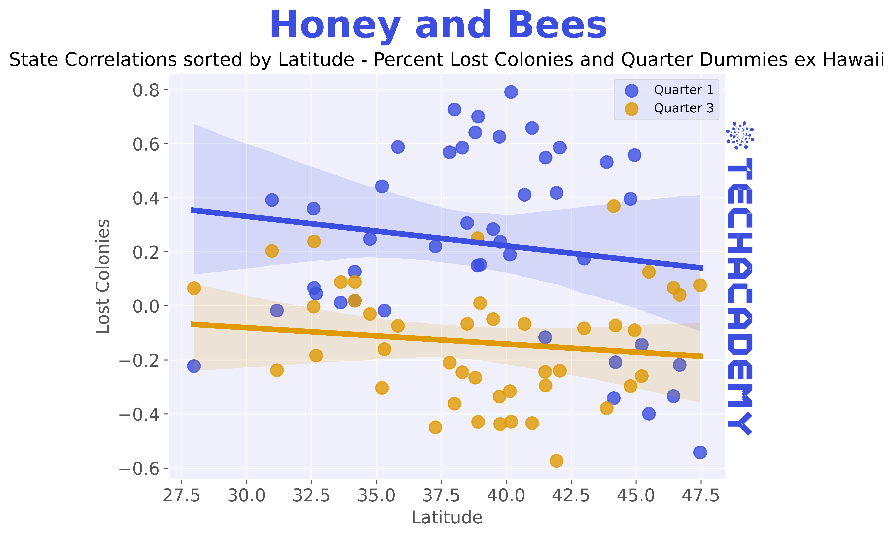
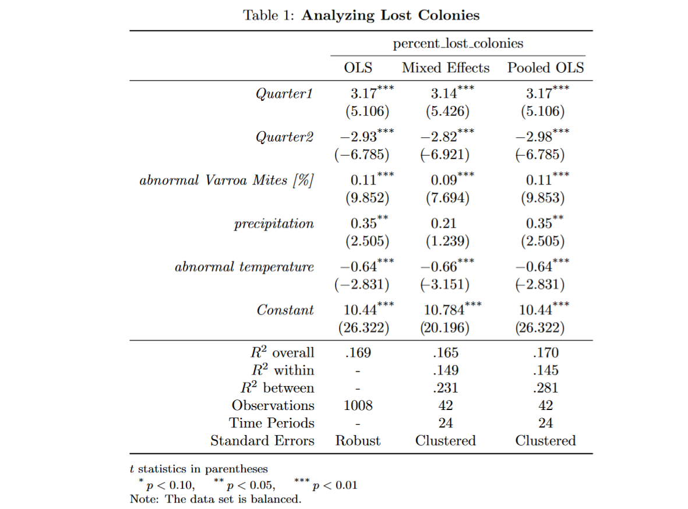

```{r, setup}
library(texPreview)
```

\newpage

# Seasonality and Geographic Differences -- Application of Statistical Methods

## Merging Bees and Weather

The first part was hopefully easy for the more advanced of you.
Let's continue with some more challenging exercises!
We want to investigate how diseases and different climates affect our beloved bee populations.
To that end, you now need to merge the two data sets "Bees" and "Weather".
Be careful when aggregating the daily weather data set to quarterly data.
It might not be clever to replace period-specific max/min values with a mean.

If you get lost, you might want to compare your approach to your solution of [4.4.1](#Merging).

## Correlations

### Naive Approach

Do a simple correlations plot between variables of your interest.
This could be lost colonies, different parasites, and weather indicators for example.
You could also create your own indication such as a temperature differential, extreme deviations from the mean of a series or interaction effects (temperature and parasites, etc. ...).

```{r, echo=FALSE, message=FALSE, warning=FALSE, fig.align="center", out.width = "100%"}
knitr::include_graphics("plot/Correlations using Pearson Method.jpg")
```

-   We have a question for you: Why is a naive correlation matrix across states a terrible idea? Think for example about omitted variables and how information is lost when you aggregate fundamentally different groups.

::: {.tips .r data-latex="r"}
Add tip
:::

::: {.tipsp .python data-latex="p"}
A handy library for plotting correlation matrices is the [seaborn library](https://seaborn.pydata.org/):

    import seaborn as sns
    ...

You can use its `pairplot` method and pass on the data frame with the selected columns to visualize distributions and correlations.

Alternatively/Additionally, you may want to plot a heatmap with `sns.heatmap(...)` which makes it even easier to see correlations.
:::

### Statewise Correlations - Seasonality & Geography

Our cross-section of states is characterized by heterogeneous geography and climate.
Naturally, this also implies seasonality in our quarterly data set.
However, Hawaii's seasons are less pronounced than they are in North Dakota (if you do not believe us, check the max temperature differential ...).

To Visualize this, you want to compute correlations statewise for either "Lost Colonies", "log Lost Colonies" or "percent lost colonies" and sort them by latitude. 

Below are some examples:

```{r, echo=FALSE, message=FALSE, warning=FALSE, fig.align="center", out.width = "100%"}
knitr::include_graphics("plot/State Correlations sorted by Latitude - Lost Colonies and Temperature ex Hawaii.jpg")
```

```{r, echo=FALSE, message=FALSE, warning=FALSE, fig.align="center", out.width = "100%"}
knitr::include_graphics("plot/State Correlations sorted by Latitude - Lost Colonies and Quarter Dummies ex Hawaii.jpg")
```

```{r, echo=FALSE, message=FALSE, warning=FALSE, fig.align="center", out.width = "100%"}

```
Note, that there might also be interaction effects, e.g. the season/climate influences the parasite population or the like.

```{r, echo=FALSE, message=FALSE, warning=FALSE, fig.align="center", out.width = "100%"}
knitr::include_graphics("plot/Seasonal (temperature-related) Parasite Infestation.jpg")
```

::: {.tips .r data-latex="r"}
Add tip
:::

::: {.tipsp .python data-latex="p"}
You should be fairly familiar with `groupby` statements by now. To sort by an underlying property of the index values, it might be of help to calculate correlations in one data frame and get a list of ordered states from another using `.reset_index()`, `.drop_duplicates()`, and `.sort_values()`. Subsequently, you can easily use `.reindex()`.
:::

## Simple Linear Models for State Panel Data
As we investigated correlation patterns above, we saw that panel data is not straightforward to analyze.
In fact, a lot more caution is necessary. Even more so since we are only equipped with quarterly data of mere 6 years - That's not a lot. You would already lose a year if you controlled with quarterly averages in your regressions.

### Naive OLS
It's instructive to look at OLS to have a reference point and to understand better why it is an inappropriate frame work. 

::: {.tips .r data-latex="r"}
Add tip
:::

::: {.tipsp .python data-latex="p"}
Add tip
:::

### Random Effects


### Pooled (Panel) OLS
```{r, echo=FALSE, message=FALSE, warning=FALSE, fig.align="center", out.width = "100%"}

```

```{texpreview, echo=FALSE}
\begin{center}
\begin{tabular}{lclc}
\toprule
\textbf{Dep. Variable:}         & log\_lost\_cols  & \textbf{  R-squared:         } &     0.166   \\
\textbf{Model:}                 &       OLS        & \textbf{  Adj. R-squared:    } &     0.161   \\
\textbf{Method:}                &  Least Squares   & \textbf{  F-statistic:       } &     33.12   \\
\textbf{Date:}                  & Sun, 24 Apr 2022 & \textbf{  Prob (F-statistic):} &  1.55e-36   \\
\textbf{Time:}                  &     15:07:10     & \textbf{  Log-Likelihood:    } &   -1729.4   \\
\textbf{No. Observations:}      &        1008      & \textbf{  AIC:               } &     3473.   \\
\textbf{Df Residuals:}          &        1001      & \textbf{  BIC:               } &     3507.   \\
\textbf{Df Model:}              &           6      & \textbf{                     } &             \\
\textbf{Covariance Type:}       &    nonrobust     & \textbf{                     } &             \\
\bottomrule
\end{tabular}
\begin{tabular}{lcccccc}
                                & \textbf{coef} & \textbf{std err} & \textbf{t} & \textbf{P$> |$t$|$} & \textbf{0.025} & \textbf{0.975}  \\
\midrule
\textbf{humidity}               &      -0.0240  &        0.005     &    -5.107  &         0.000        &       -0.033    &       -0.015     \\
\textbf{cloudcover}             &       0.0044  &        0.004     &     1.194  &         0.233        &       -0.003    &        0.012     \\
\textbf{precip}                 &      -0.1782  &        0.034     &    -5.288  &         0.000        &       -0.244    &       -0.112     \\
\textbf{Varroa Mites (Percent)} &       0.0225  &        0.002     &     9.282  &         0.000        &        0.018    &        0.027     \\
\textbf{constant}               &       8.9969  &        0.290     &    31.014  &         0.000        &        8.428    &        9.566     \\
\textbf{quarter\_1}             &       0.0322  &        0.110     &     0.292  &         0.771        &       -0.184    &        0.249     \\
\textbf{quarter\_3}             &       0.0067  &        0.111     &     0.061  &         0.952        &       -0.211    &        0.224     \\
\bottomrule
\end{tabular}
\begin{tabular}{lclc}
\textbf{Omnibus:}       &  8.176 & \textbf{  Durbin-Watson:     } &    0.662  \\
\textbf{Prob(Omnibus):} &  0.017 & \textbf{  Jarque-Bera (JB):  } &    8.378  \\
\textbf{Skew:}          &  0.181 & \textbf{  Prob(JB):          } &   0.0152  \\
\textbf{Kurtosis:}      &  3.261 & \textbf{  Cond. No.          } &     571.  \\
\bottomrule
\end{tabular}
%\caption{OLS Regression Results}
\end{center}

Notes: \newline
 [1] Standard Errors assume that the covariance matrix of the errors is correctly specified.
```

```{texpreview, echo=FALSE}
\usepackage{threeparttable}
\usepackage{siunitx}
\usepackage[utf8]{inputenc}
\usepackage{amsmath,amsfonts,amssymb}

\begin{table}[htb]
  \centering
  \sisetup{table-number-alignment = center, 
           table-space-text-pre ={\(},
           table-space-text-post={\textsuperscript{***}},
           input-open-uncertainty={\[},
           input-close-uncertainty={\]},
           table-align-text-pre=false,
           table-align-text-post=false}
  \begin{threeparttable}
  \caption{IV Analysis: Investment on Bribes table}
  \label{tab1}
  \begin{tabular}{r 
                  S[table-format=-2.3]
                  S[table-format=-1.4] 
                  S[table-format=-1.5] 
                 }
  \toprule
                      & \multicolumn{3}{c}{ln\_invest}                                \\
  \cmidrule(lr){2-4}
                      &   {(1)}           &   {(2)}           &  {(3)}                \\
  \midrule
  Bribe               &  -0.167           &  -0.0617          &   0.00939             \\
                      & (-0.90)           & (-0.44)           &  (0.13)               \\
  \addlinespace
  medium (20-99)      &   0.339           &   0.298           &   1.024\tnote{***}    \\
                      &  (0.90)           &  (0.73)           &  (8.74)               \\
  \addlinespace
  large (100 and over)&  2.426\tnote{***} &   1.578\tnote{**} &   2.654\tnote{***}    \\
                      &  (4.31)           &  (2.79)           & (17.07)               \\
  \addlinespace
  Govt=1              &   0.764           &   0.735           &  -0.112               \\
                      &  (1.31)           &  (1.42)           & (-0.63)               \\
  \addlinespace
  For=1               &  -0.341           &  -0.486           &   0.326\tnote{*}      \\
                      & (-0.95)           & (-1.41)           &  (2.14)               \\
  \addlinespace
  Obstacle            &   0.111           &   0.0340          &   0.114               \\
                      &  (0.64)           &  (0.20)           &  (1.13)               \\
  \addlinespace
  Agree               &  -0.123           &  -0.0445          &   0.0196              \\
                      & (-0.66)           & (-0.25)           &  (0.18)               \\
  \addlinespace
  lnAge               &   0.155           &   0.734\tnote{**} &   0.122               \\
                      &  (0.62)           &  (2.63)           &  (1.90)               \\
  \addlinespace
  Constant            &  10.13\tnote{***} &  8.684\tnote{***} &   8.062\tnote{***}    \\
                      &  (12.78)          &  (9.98)           & (23.18)               \\
  \midrule
  Observations        & {6041}            & {4724}            & {1317}                \\
  \bottomrule
  \end{tabular}
      \smallskip
      \footnotesize
  $t$ statistics in parentheses\par
  \begin{tablenotes}[para]
      \item[*]    $p < 0.10$,
      \item[**]   $p < 0.05$,
      \item[***]  $p < 0.01$
  \end{tablenotes}\par
  Note: Robust standard errors in parentheses
  \end{threeparttable}
\end{table}
```

## Model Evaluation
Model evaluation is always important, even more so when using different frameworks that you would like to compare.
At the end of the day, we are interested in the model that reflects our empirical observations best.

### Residuals Distribution (in-sample)
When computing regression estimates the residuals as unexplained fraction of your model are the most important aspect to look at. Especially since each model assumes a certain distribution (normal most of the time). We must check whether these assumptions hold.
Typical related questions are whether they are auto-correlated and whether the standard errors are computed robust. 

