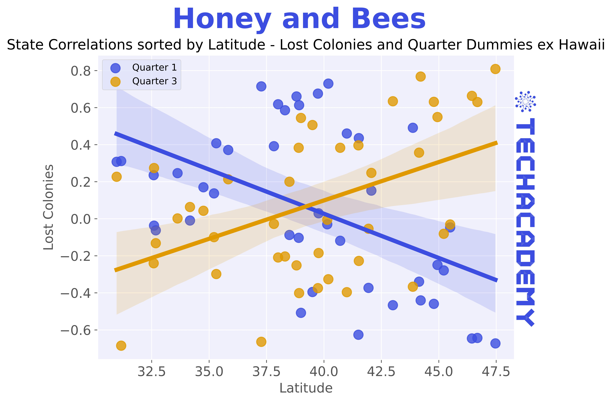
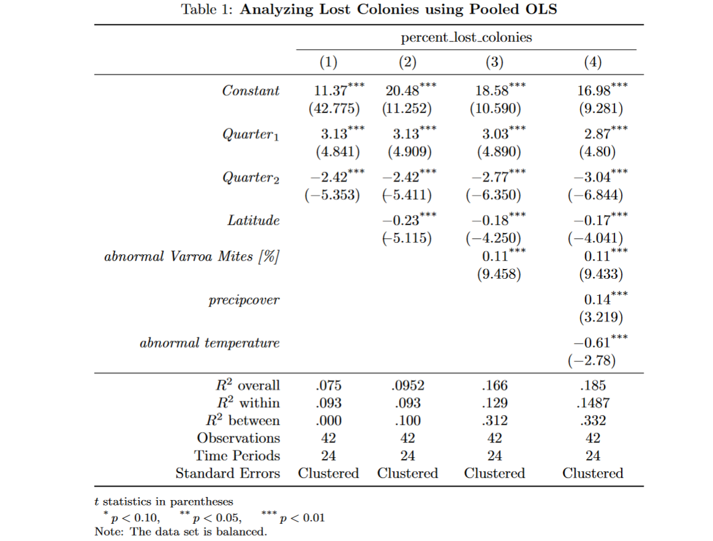

\newpage

# Seasonality and Geographic Differences -- Application of Statistical Methods

## Merging Bees and Weather

Hopefully the first part was easy for the more advanced of you. Regardless, let's continue with some more challenging exercises!

We want to investigate how diseases and different climates affect our beloved bee populations.
To that end, you now need to merge the two data sets "Bees" and "Weather", and we will no longer be using the data that we have previously merged.
As in the previous exercie, both data sets have different frequencies, can you spot the difference? To merge you will need to aggregate the daily weather data set to quarterly data. Be carefull when aggregating the data though, it might not be clever to replace period-specific max/min values with a mean!

If you get lost, you might want to compare your approach to your solution of [4.4.1](#Merging).

Please note that there is no weather data for **Florida** and **New Mexico**, you should exclude these states.

## Correlations

### Naive Approach

After merging the data sets into, let's start with some analysis. To cover our basis, we would like to start off by plotting a simple correlations plot for the variables of interest. You can pick which variables you would like to plot!
This could be lost colonies, different parasites, and weather indicators for example.

```{r, echo=FALSE, message=FALSE, warning=FALSE, fig.align="center", out.width = "100%"}
knitr::include_graphics("plot/Correlations using Pearson Method.jpg")
```

-   We have a question for you: Why is a naive correlation matrix across states likely a bad idea? Think for example about omitted variables and how information is lost when you aggregate fundamentally different groups.

::: {.tips .r data-latex="r"}
Use the cor() function from the `base` R to create a correlation matrix. Select all numerical variables in your data set with the help of sapply() or `dplyr`’s select() and create a correlation matrix.

Alternatively, use the ggcorrplot() from the same-name [{ggcorrplot}](https://cran.r-project.org/web/packages/ggcorrplot/index.html) package.

:::

::: {.tipsp .python data-latex="p"}
A handy library for plotting correlation matrices is the [seaborn library](https://seaborn.pydata.org/):

    import seaborn as sns
    ...

You can use its `pairplot` method and pass on the data frame with the selected columns to visualize distributions and correlations.

Alternatively/Additionally, you may want to plot a heatmap with `sns.heatmap(...)` which makes it even easier to see correlations.
:::

### Statewise Correlations - Seasonality & Geography

Our cross-section of states is characterized by heterogeneous geography and climate.
Naturally, this also implies seasonality in our quarterly data set.
However, Hawaii's seasons are less pronounced than they are in North Dakota (if you do not believe us, check the max temperature differential ...).

To Visualize this, you want to compute statewise correlations for either "Lost Colonies", "log Lost Colonies" or "percent Lost Colonies" and sort them by latitude. 

Below are some examples:

```{r, echo=FALSE, message=FALSE, warning=FALSE, fig.align="center", out.width = "100%"}

```

```{r, echo=FALSE, message=FALSE, warning=FALSE, fig.align="center", out.width = "100%"}
knitr::include_graphics("plot/State Correlations sorted by Latitude - Lost Colonies Percent and Quarter Dummies ex Hawaii.jpg")
```
Note, that there might also be interaction effects, e.g. the season/climate influences the parasite population or the like.

```{r, echo=FALSE, message=FALSE, warning=FALSE, fig.align="center", out.width = "100%"}
knitr::include_graphics("plot/Seasonal (temperature-related) Parasite Infestation.jpg")
```

::: {.tips .r data-latex="r"}
Add tip
:::

::: {.tipsp .python data-latex="p"}
You should be fairly familiar with `groupby` statements by now. To sort by an underlying property of the index values, it might be of help to calculate correlations in one data frame and get a list of ordered states from another using `.reset_index()`, `.drop_duplicates()`, and `.sort_values()`. Subsequently, you can easily use `.reindex()`.
:::

### Demeaned Variables
Create at least two own indications that you might want to use in the following regressions which can mitigate some of the issues:

* One Measure that subtracts a quarter aggregate (median, mean ...) over ALL states but by quarter (4 values in total) from each observation with that respective quarter

* One Measure that subtracts a quarter aggregate by state AND quarter (values equal to the number of states * 4) from all observations with the respective state and quarter

**Example for the 2nd**: You create a measure of "abnormal" temperature by subtracting the average temperature of a given state in each quarter from the state's quarter observation in all years (6 years in total) in the data set.

Additionally, add quarter dummies to your data frame.

::: {.tips .r data-latex="r"}
Add tip
:::

::: {.tipsp .python data-latex="p"}
You best work with a `Multiindex` and employ the `.dt.quarter` property of `Datetime` columns.
After aggregating, you can merge the values back as an additional column and simply subtract as well as reassign the result.
:::

## Pooled OLS for State Panel Data
As we investigated correlation patterns above, we saw that panel data is not straightforward to analyze. Especially since we are only equipped with quarterly data of mere 6 years - That's not a lot.
But you have just added a few more "normalized" variables, so we can get started with our regressions in the hope to make some interesting findings.

With panel data the basic extension of OLS (Ordinary Least Squares) regression is Pooled OLS.
A basic Pooled OLS regression equation could look like this (a simple extension of classic OLS with state effects $\alpha_i$ and error term $\epsilon_{i,t}$:

$$
percent\_lost\_colonies_{i, t} = \mu + \beta_{1,i} \cdot varroa\_mites_{i, t} + \beta_2 \cdot quarter_1 + \dots + \alpha_i + \epsilon_{i,t}
$$

### Seasonality Specification
Compute pooled OLS regression estimates that reflect only seasonal aspects.
Subsequently, you will extend this model below. At the end of this section is a [#table] that may serve as an indication of what the end result could look like.

::: {.tips .r data-latex="r"}
Add tip
:::

::: {.tipsp .python data-latex="p"}
A classic package for inference is [statsmodels](https://www.statsmodels.org/stable/generated/statsmodels.regression.linear_model.OLS.html#statsmodels.regression.linear_model.OLS). Standard OLS is pretty straightforward but not needed here. 
[linearmodels](https://pypi.org/project/linearmodels/) is an extension library that supports the analysis of panel data.
:::

### Adding Geographic Aspects
Extend your specification from above with at least one variable that reflects each states "unique" geography. 
Whenever you add more variables be careful to avoid (multi-) collinearity (= your regressors are highly correlated among themselves).

### Adding indicators for weather and parasite infestation
Last but not least add variables (maybe some of the ones created above) that can explain even more, considering for example weather extrema and parasite infestation.

When you compare all the $R^2$ of the different specifications with special attention to *within* and *between* $R^2$ what do you observe?

```{r, echo=FALSE, message=FALSE, warning=FALSE, fig.align="center", out.width = "100%"}

```

## Alternative Model 
You are completely free here. You want to check out a machine-learning approach and compare? This is your chance!
All you have to do is estimate an alternative model (so not pooled OLS again) whose properties you can compare in a later stage.

## Model Evaluation
Model evaluation is always important, even more so when using different frameworks that you would like to compare.
At the end of the day, we are interested in the model that reflects our empirical observations best.

### Residuals Distribution (in-sample)
When computing regression estimates the residuals as unexplained fraction of your model are the most important aspect to look at. Especially since each model assumes a certain distribution (normal most of the time). We must check whether these assumptions hold.
Typical related questions are whether they are auto-correlated and whether the standard errors are computed robust (e.g. test for the presence of heteroscedasticity etc.). 

Plot the residuals of one of your pooled OLS specifications and the ones of your alternative model. Do they differ fundamentally?

::: {.tips .r data-latex="r"}
Add tip
:::

::: {.tipsp .python data-latex="p"}
Your fitted models will have something like a `.predict()` method which also yields the in-sample fitted values. Moreover, the fitted model will automatically compute the residuals, for example the `.resids` attribute that you can work with. 
Of course you could also use the regression estimates to compute both values yourself!
:::

```{r, echo=FALSE, message=FALSE, warning=FALSE, fig.align="center", out.width = "100%"}
knitr::include_graphics("plot/Pooled OLS Aggregate Residuals.jpg")
```

### Model Selection
As a wrap-up, by considering the different specifications as well as your alternative model, write a few sentences about which specification/model you believe to be best-suited for the underlying data.

**Congratulations!** You’ve made it to the end of your TechAcademy Data Science project. After visualizing the data in the first part, you’ve also set up a statistical analysis in this section. If you stuck around until this part and managed to code the better part of the exercises, you’ve definitely earned your certificate! We hope you had fun learning Data Science with this combination of data sets and enjoyed it – at least the parts where you didn’t get stuck forever because of some unexplainable coding error. Don’t forget to send your project results to our project submission email address before the deadline (**03.07.2022, 23:59**).
Thanks for being a part of TechAcademy!
